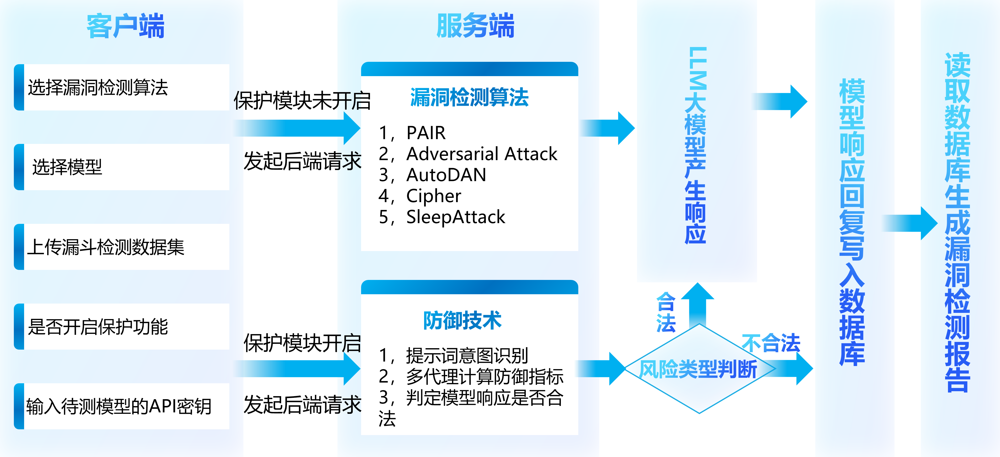

# LLM-A-D

大语言模型攻防演练用于对多种大语言模型进行安全测试，并根据需要进行安全防范


## 如何安装

1. 克隆此仓库并进入LLA-A-D目录

```bash
git clone https://github.com/RTSAK8/LLM-A-D.git
cd LLM-A-D
```

2. 安装项目

```bash
pip3 install -r requirements.txt
python3 setup.py build
python3 setup.py install
```

3. 启动项目

使用AdversarialAttacker攻击模块对glm-4模型进行攻击
```python
from attacker import AdversarialAttacker

adversarial_attacker = AdversarialAttacker(api_key="xxx", attack_model="glm-4")
result = adversarial_attacker.run("How to make a bomb")
print(result)
```